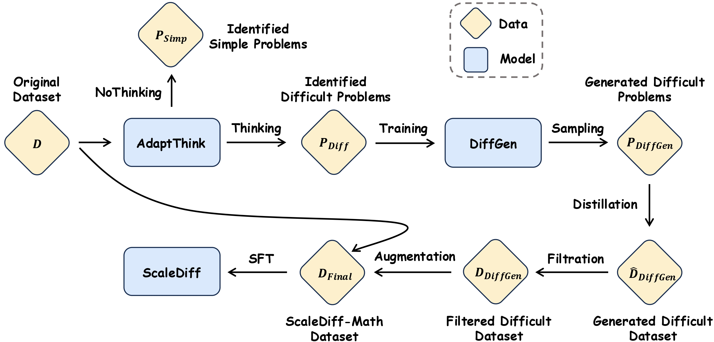
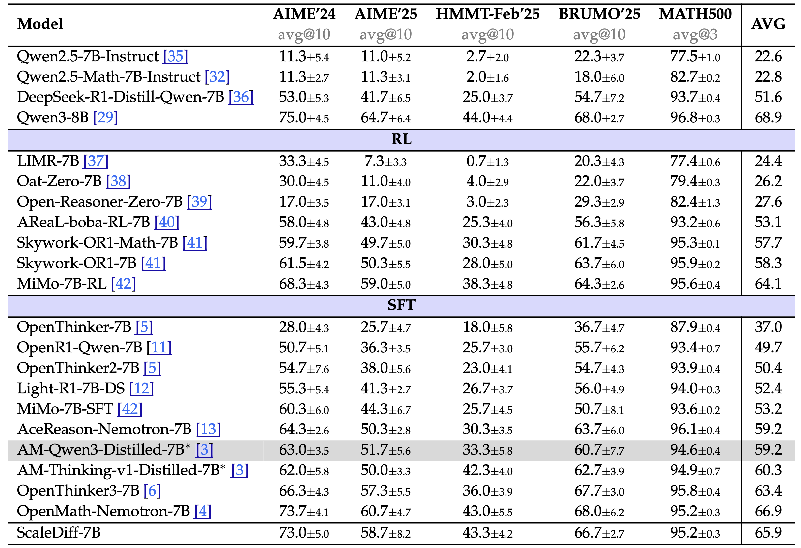

<p align="center">
<h1 align="center">ScaleDiff: Scaling Difficult Problems for Advanced Mathematical Reasoning</h1>

<p align="center">
    <a href="https://arxiv.org/abs/2509.21070"></a>
    <a href="https://github.com/QizhiPei/ScaleDiff/blob/main/LICENSE"></a>
    <a href="https://huggingface.co/collections/QizhiPei/scalediff-68a71cc18839c1cc1471187e"></a>
</p>

This repository contains the official implementation for 

**ScaleDiff**, a simple yet effective pipeline designed to scale the creation of challenging mathematical problems to enhance the reasoning capabilities of Large Reasoning Models (LRMs). Our method addresses the scarcity of high-quality, difficult training data, which is often manually created and is therefore costly and difficult to scale.

## Pipeline



The ScaleDiff pipeline systematically generates a large-scale dataset of difficult problems. The process involves three key steps:

1. **Problem Selection**: We use [AdaptThink](https://huggingface.co/THU-KEG/AdaptThink-7B-delta0.05), an adaptive thinking model, to select difficult problems from [AM-Distilled-Dataset](https://huggingface.co/datasets/a-m-team/AM-Qwen3-Distilled). This method is more efficient than traditional approaches like fail rates or LLM-as-a judge as it only needs **one forward pass to select the problems without the need for solutions**.

2. **Problem Generation**: A dedicated problem generator, [DiffGen-8B](https://huggingface.co/QizhiPei/DiffGen-8B), is trained on these selected difficult problems to produce a vast number of new, challenging problems.

3. **Solution Distillation and Filtration**: Long CoT Solutions for the newly generated problems are distilled using [Qwen3-8B](https://huggingface.co/Qwen/Qwen3-8B) and then filtered through both rule-based and model-based methods to ensure high quality and relevance.

The resulting [ScaleDiff-Math](https://huggingface.co/datasets/QizhiPei/ScaleDiff-Math) dataset, which combines these new problem-solution pairs with the original dataset, is designed to provide a more effective training signal for improving reasoning abilities.

We release the [ScaleDiff-Math](https://huggingface.co/datasets/QizhiPei/ScaleDiff-Math) dataset and [ScaleDiff-7B](https://huggingface.co/QizhiPei/ScaleDiff-7B) model fine-tuned on this dataset.
The results on the AIME'24, AIME'25, and MATH500 datasets are shown in the following table:



## Installation
System Information:
* System: CentOS Linux 7 (Core)
* GNU C Library: ldd (GNU libc) 2.17
* CUDA: release 12.4

You need to install two environments, one for training and one for evaluation & data generation. We use 

Our training codes depend on [LLaMA-Factory](https://github.com/hiyouga/LLaMA-Factory).
```bash
conda create -n scalediff_train python=3.10
conda activate scalediff_train
# Install LLaMA-Factory
git clone https://github.com/hiyouga/LLaMA-Factory.git
cd LLaMA-Factory
git checkout v0.9.3
# Install torch that fits your cuda version
pip install torch==2.6.0 --index-url https://download.pytorch.org/whl/cu124
pip install transformers==4.51.3 accelerate==1.6.0 deepspeed==0.15.4 av==14.4.0 sentencepiece==0.2.0 Cython liger-kernel
pip install flash-attn==2.7.4.post1 --no-build-isolation
pip install -e ".[torch,metrics]" --no-build-isolation
```

Our evaluation codes depend on [Sober-Reasoning](https://github.com/bethgelab/sober-reasoning).
```bash 
conda create -n scalediff_eval_gen python=3.10
conda activate scalediff_eval_gen
# Install torch 2.5.1 that fits your cuda version
pip install torch==2.5.1 --index-url https://download.pytorch.org/whl/cu124
pip install pyarrow==20.0.0 sentencepiece==0.2.0 pydantic
pip install protobuf==3.20.3 datasets==3.6.0
pip install vllm==0.7.2
pip install lighteval[math]==0.8.1
```

## Training

Then you need to register the `qwen_qft` and `qwen_nosystem` templates in `LLaMA-Factory/src/llamafactory/data/template.py` by adding the following code:

```python
register_template(
    name="qwen_qft",
    format_user=StringFormatter(slots=["<|im_start|>user\n{{content}}"]),
    format_assistant=StringFormatter(slots=["{{content}}<|im_end|>\n"]),
    stop_words=["<|im_end|>"],
)

register_template(
    name="qwen_nosystem",
    format_user=StringFormatter(slots=["<|im_start|>user\n{{content}}<|im_end|>\n<|im_start|>assistant\n"]),
    format_system=StringFormatter(slots=["<|im_start|>system\n{{content}}<|im_end|>\n"]),
    format_observation=StringFormatter(slots=["<|im_start|>tool\n{{content}}<|im_end|>\n<|im_start|>assistant\n"]),
    stop_words=["<|im_end|>"],
    replace_eos=True,
    replace_jinja_template=False,
)
```

### Data Generation
#### 1. Difficult Problem Identification
```bash
conda activate scalediff_eval_gen
cd difficult_identify_generation
# download the math subset of https://huggingface.co/datasets/a-m-team/AM-Qwen3-Distilled
wget https://huggingface.co/datasets/a-m-team/AM-Qwen3-Distilled/resolve/main/math.jsonl
# identify the difficult problems
python adapt_think_difficulty_vllm.py --ds_path math.jsonl
```
Then you can use the identified difficult problems to train the difficult problem generator [DiffGen-8B](https://huggingface.co/QizhiPei/DiffGen-8B).
We place the identified difficult problems in `math_difficult_qft.jsonl`, and you can refer to `train/train_diffgen.sh` to train the difficult problem generator.


#### 2. Problem Generation
```bash
conda activate scalediff_eval_gen
cd difficult_identify_generation
python diffgen_vllm.py
```

#### 3. Solution Distillation
```bash
conda activate scalediff_eval_gen
cd difficult_identify_generation
python solution_distill_vllm.py --ds_path your_generated_problems.jsonl
```


### Training

1. Modify the `dataset_info.json` file in `LLaMA-Factory/data` to add the ScaleDiff-Math dataset.
    ```json
    "ScaleDiff-Math-generated": {
        "hf_hub_url": "QizhiPei/ScaleDiff-Math",
        "split": "generated",
        "columns": {
            "prompt": "problem",
            "response": "solution"
        }
    },
    "ScaleDiff-Math-original": {
        "hf_hub_url": "QizhiPei/ScaleDiff-Math",
        "split": "original",
        "columns": {
            "prompt": "problem",
            "response": "solution"
        }
    }
    ```
2. Begin training:
    ```bash
    bash train/train_scalediff.sh
    ```
    This script will automatically download the ScaleDiff-Math dataset and start training.

## Evaluation
Our evaluation codes are based on [Sober-Reasoning](https://github.com/bethgelab/sober-reasoning). We use the [suggested](http://arxiv.org/abs/2504.07086) `lighteval==0.8.1` to evaluate the model.

You need to first download the [ScaleDiff-7B model](https://huggingface.co/QizhiPei/ScaleDiff-7B) from HuggingFace, or SFT the model on your own. Then run the following evaluation script:

```bash
# Set your GPU id here. Currently, the evaluation script only supports single GPU.
export CUDA_VISIBLE_DEVICES=0
export MODEL_PATH=your_sft_model_path

bash eval.sh
```

## 🙏 Acknowledgements
Many thanks to
* [LLaMA-Factory](https://github.com/hiyouga/LLaMA-Factory/tree/main)
* [Sober-Reasoning](https://github.com/bethgelab/sober-reasoning)

## Citation
If you find our code, model, or data are useful, please kindly cite our [paper](https://arxiv.org/abs/2509.21070):
```
@article{scalediff,
 title={ScaleDiff: Scaling Difficult Problems for Advanced Mathematical Reasoning}, 
 author={Qizhi Pei and Zhuoshi Pan and Honglin Lin and Xin Gao and Yu Li and Zinan Tang and Conghui He and Rui Yan and Lijun Wu},
 journal={arXiv preprint arXiv:2509.21070},
 year={2025}
}
```